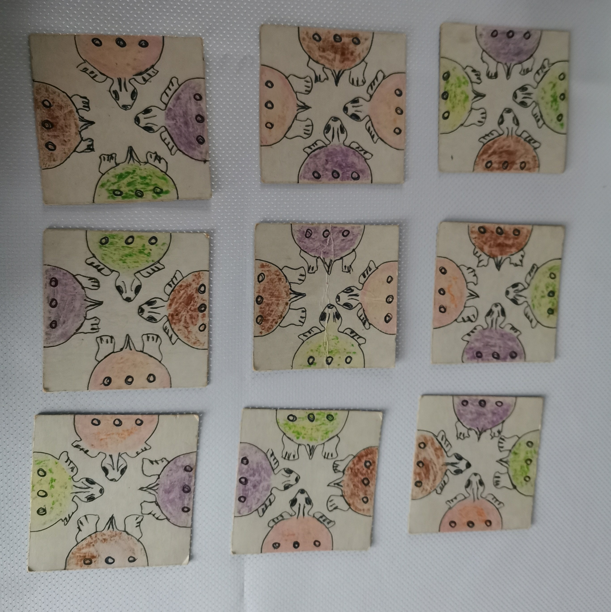
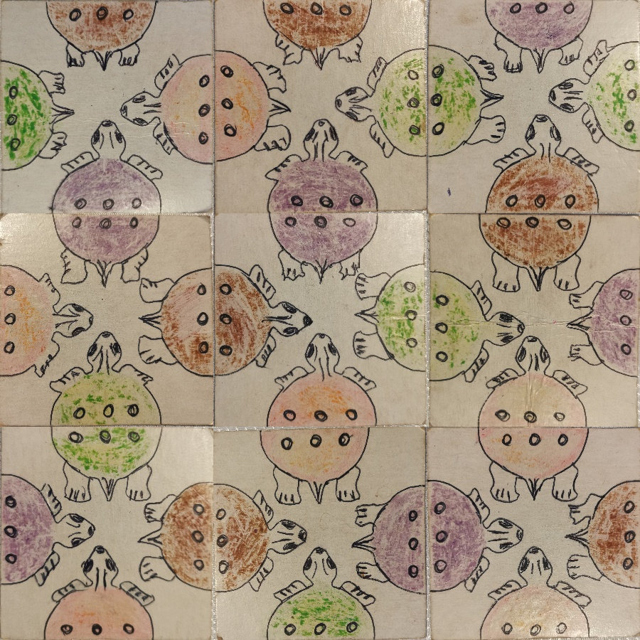

## turtle_puzzle_solver

One day I found a 3x3 puzzle with colorful turtles, which I tried to put together when I was a child. Still arranging them properly is not trivial. So why not, in a break from work, use the computer to do it... 😀




So let's:

- Make photos of each puzzle element,
- prepare a `data.json` file with tags of color and head/tail of each turtle,
- write some Python code,
- run it: 

    ```python solve.py```
- ...and finally got puzzle solved! 🥳


